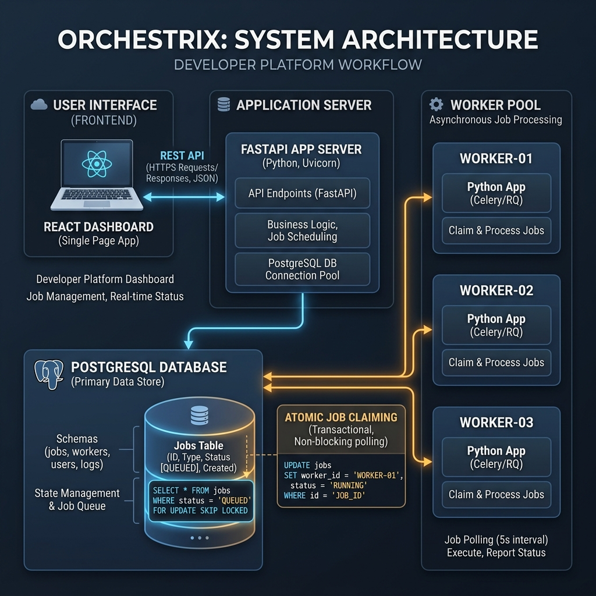
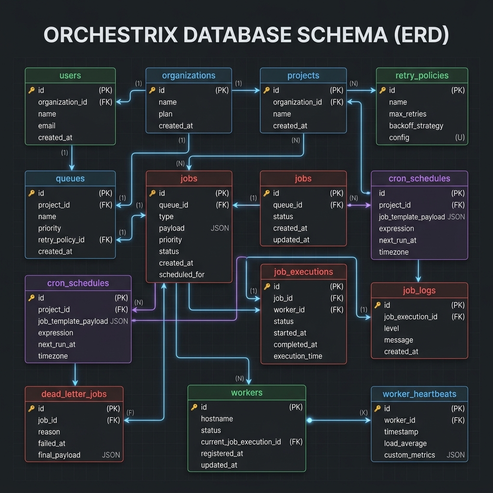

# Orchestrix Design Decisions & Architectural Specifications

This document outlines the system engineering decisions, database design schemas, and architectural trade-offs made during the design and development of Orchestrix.

---

## 1. Concurrency Control: Atomic Claiming

### The Problem
In distributed job processing, multiple worker nodes poll the central database for queued jobs. Without concurrency controls, race conditions can occur:
1. Worker 1 reads Job A (`status = 'queued'`).
2. Worker 2 reads Job A (`status = 'queued'`).
3. Worker 1 marks Job A as `claimed` and starts executing.
4. Worker 2 marks Job A as `claimed` and starts executing.
This results in **duplicate execution**, violating the execution guarantee.

### Our Solution
We implement row-level database locks. When a worker requests a job:
```sql
SELECT id FROM jobs 
WHERE status = 'queued' 
  AND (scheduled_at IS NULL OR scheduled_at <= NOW())
  AND queue_id IN (/* Allowed queues */)
ORDER BY priority DESC, created_at ASC
LIMIT 1
FOR UPDATE SKIP LOCKED;
```
- **`FOR UPDATE`**: Locks the matched row so no other connection can update or lock it.
- **`SKIP LOCKED`**: If a row is already locked by another worker's claim transaction, instead of blocking/waiting, Postgres skips that row and returns the next eligible unlocked row.
This ensures claiming takes **O(1)** time for workers without locks causing thread contention.

### SQLite Fallback
For local development where PostgreSQL is unavailable, we enable WAL (Write-Ahead Logging) mode and serialize claims using a global threading mutex to prevent concurrent write lock contention.

---

## 2. Database Schema & Indexing

The schema is built in a relational pattern to maintain strong database-level constraints:
1. **`users`**: Store user login credentials and roles.
2. **`organizations`**: Organizes projects and users.
3. **`projects`**: Acts as a namespace container for queues.
4. **`queues`**: Holds configuration details (concurrency limit, priority, paused state).
5. **`retry_policies`**: Extends queue configuration with custom backoff details.
6. **`jobs`**: Store the core payload, status, scheduler timestamps, and reference worker.
7. **`job_executions`**: Tracks every individual attempt history for audit trails and analytics.
8. **`job_logs`**: Logs step-by-step stdout/stderr events linked to executions.
9. **`worker_heartbeats`**: Raw heartbeat timestamps from worker fleet nodes.
10. **`dead_letter_jobs`**: Failed jobs with failure categories and analytics.

### Database Indexing Strategy
To optimize query planning and prevent table scans under high load, we implement the following indexes:

| Table | Index Name | Columns | Purpose |
| :--- | :--- | :--- | :--- |
| **`jobs`** | `idx_jobs_queue_status` | `(queue_id, status)` | Fast queue polling and filtering |
| **`jobs`** | `idx_jobs_status_scheduled` | `(status, scheduled_at)` | Fast scheduled/delayed job lookup |
| **`jobs`** | `idx_jobs_queue_priority_created` | `(queue_id, priority, created_at)` | Fast priority-based worker claiming |
| **`jobs`** | `idx_jobs_worker_id` | `(worker_id)` | Fast worker crash recovery lookups |
| **`job_executions`** | `ix_job_executions_job_id` | `(job_id)` | Fast execution history joins |
| **`job_logs`** | `ix_job_logs_job_id` | `(job_id)` | Fast logs lookup for job details view |
| **`worker_heartbeats`** | `ix_worker_heartbeats_worker_id` | `(worker_id)` | Fast heartbeat historical fetches |
| **`worker_heartbeats`** | `ix_worker_heartbeats_timestamp` | `(timestamp)` | Fast heartbeat age queries |

---

## 3. System Diagrams

### High-Level System Architecture


### Entity-Relationship Diagram (ERD)


---

## 4. API Endpoints

### AUTHENTICATION
- `POST /api/auth/register` - Register a new developer user account (auto-seeds project & default queues)
- `POST /api/auth/login` - Obtain OAuth2 JWT access token

### PROJECTS
- `GET /api/projects` - List all projects mapped to the user's organization
- `POST /api/projects` - Create a new project namespace

### QUEUES
- `GET /api/queues` - List queues with job count statistics
- `POST /api/queues` - Provision a new queue partition
- `POST /api/queues/{id}/pause` - Pause queue execution (stops workers claiming new tasks)
- `POST /api/queues/{id}/resume` - Resume queue execution

### JOBS
- `GET /api/jobs` - Paginated jobs list with filter parameters
- `POST /api/jobs` - Enqueue an Immediate, Delayed, or Scheduled job
- `POST /api/jobs/batch` - Atomically enqueue a batch of job payloads
- `GET /api/jobs/{id}` - Fetch details of a specific job (history & logs)

### WORKERS
- `GET /api/workers` - Get active worker fleet status and system resource metrics
- `POST /api/workers/heartbeat` - Worker heartbeat reporting route
- `POST /api/workers/claim` - Claim next eligible job transactionally
- `POST /api/workers/{id}/terminate` - Force crash worker nodes to simulate failovers

### CRON
- `GET /api/cron` - List recurring cron routines
- `POST /api/cron` - Define a new cron schedule expression
- `POST /api/cron/{id}/pause` - Pause cron job scheduling
- `POST /api/cron/{id}/resume` - Resume cron job scheduling
- `DELETE /api/cron/{id}` - Delete a recurring cron schedule

### DLQ (Dead Letter Queue)
- `GET /api/dlq` - List permanently failed jobs with classification categories
- `POST /api/dlq/{id}/replay` - Retry a dead job (resets retry counters and queues it)

---

## 5. Architectural Trade-offs & Design Decisions

### Why PostgreSQL?
We chose PostgreSQL as the primary storage engine because of its enterprise-grade transactional properties, query planner optimizer, and native support for concurrency claiming controls (`FOR UPDATE SKIP LOCKED`). It allows us to manage structured relations (users, projects, queues, heartbeats) and task queues in a unified engine with zero overhead from separate message brokers (like RabbitMQ) or cache key managers (like Redis).

### Why Database-Backed Queues?
While dedicated message brokers (e.g. RabbitMQ) have higher raw throughput, they lack database features:
1. **No Relational Integrity**: A job payload cannot easily maintain foreign keys linking to organizations, projects, or executions.
2. **Hard to Audit**: Completed or failed jobs are removed from memory queues. A database maintains job records forever, permitting historical analysis and pagination.
3. **Transaction Alignment**: We can enqueue jobs in the exact same transaction that updates our business model records, eliminating distributed transactions.

### Why FOR UPDATE SKIP LOCKED?
Older database queuing patterns used `UPDATE jobs SET status = 'claimed' ... WHERE id = (...)` which caused high thread contention, lock queue waits, and serialization bottlenecks. By using `SKIP LOCKED`, workers do not block waiting for locks to release. They skip locked rows immediately and process the next available task.

### Why At-Least-Once Delivery?
In distributed environments, networks are unreliable. If we used *at-most-once* delivery, a worker claiming a job might crash before completing it, resulting in lost data. By using *at-least-once* delivery, a job is requeued if a worker fails to send heartbeats, ensuring it is executed eventually.

### Why Idempotency is Important?
Since at-least-once guarantees can deliver a job multiple times (e.g., if a worker crashes midway or network delays cause heartbeats to time out), application workers must design their executions to be idempotent (processing the same payload twice yields identical state results).

### Why Polling instead of WebSockets?
WebSockets are persistent TCP connections that require stateful API gateways and memory buffers. Long polling or short interval polling (every 3 seconds) simplifies the API gateway structure, allowing it to scale stateless workers horizontally.

### Why Heartbeat-Based Worker Detection?
Without heartbeats, if a worker node crashes (e.g. OOM, physical server crash), the jobs it claimed remain locked forever. Heartbeats allow stateless nodes to self-report, and a simple central recovery daemon can identify expired nodes and restore stuck jobs safely.

### Why Fixed/Linear/Exponential Retry Strategies?
Different failures require different backoffs:
- **FIXED**: Good for fast transient retries.
- **LINEAR**: Steadily increases waiting time.
- **EXPONENTIAL**: Ideal for downstream systems experiencing rate limits or severe outages, preventing the "thundering herd" problem.

### Why Pattern Diagnostics instead of a Mock AI Model?
Pretending to run a local large language model (LLM) inside a lightweight background container is resource-heavy and slow. Deterministic failure pattern parsing (regex exception classifiers) matches standard runtime traces reliably, instantly, and with zero resource consumption.
